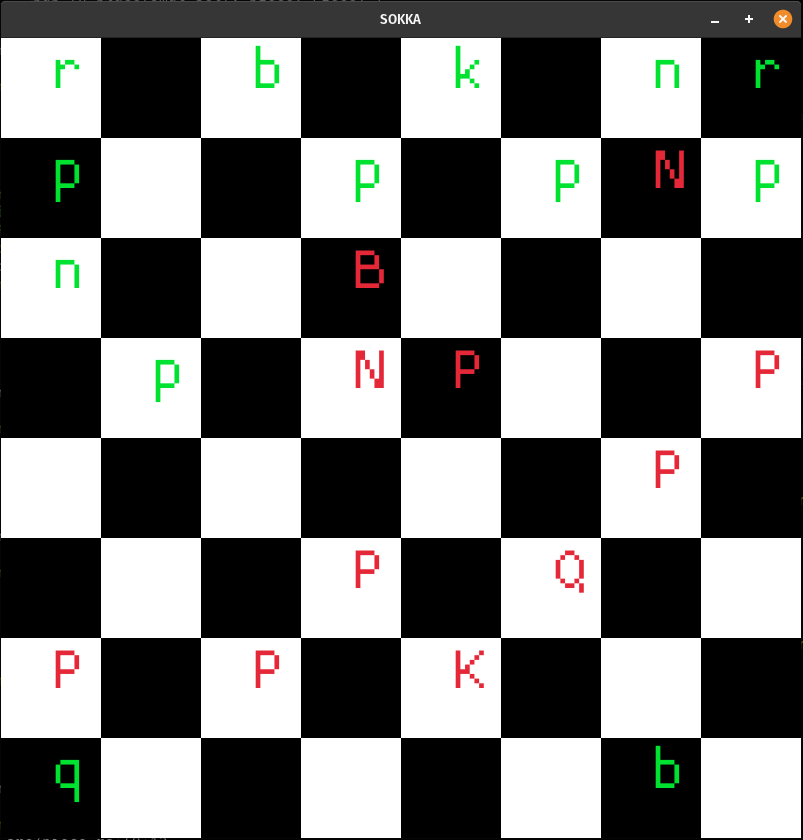

## Sokka 

Aim: A Chess Engine
---

Run project:
> cargo run

Step 1:
- draw board for a given FEN string:

result:
- board for FEN string `r1b1k1nr/p2p1pNp/n2B4/1p1NP2P/6P1/3P1Q2/P1P1K3/q5b1.`

TODO:
- movement
